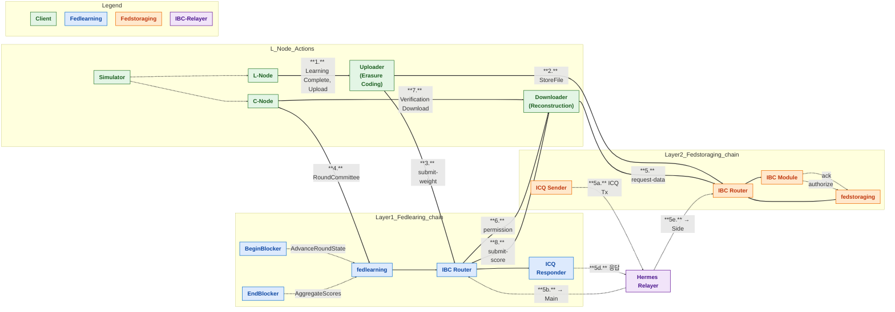

```mermaid
%%{init: {'flowchart': {'htmlLabels': true}, 'themeVariables': {'fontSize': '35px', 'fontFamily': 'Noto Sans', 'subGraphTitleWrap': false}}}%%
graph LR
    classDef client fill:#E3F5E5,stroke:#2E7D32,stroke-width:2.5px,font-size:33px,color:#1B5E20,font-weight:bold;
    classDef main fill:#DDEAFD,stroke:#1976D2,stroke-width:2.5px,font-size:33px,color:#0D47A1,font-weight:bold;
    classDef side fill:#FFE8CC,stroke:#EF6C00,stroke-width:2.5px,font-size:33px,color:#BF360C,font-weight:bold;
    classDef relay fill:#F1E4F9,stroke:#6A1B9A,stroke-width:2.5px,font-size:33px,color:#4A148C,font-weight:bold;
    classDef legend fill:#FAFAFA,stroke:#757575,stroke-width:2px,stroke-dasharray:5 5,font-size:18px,color:#212121,font-weight:bold;
    classDef spacer fill:transparent,stroke:transparent, font-size:0px;
    linkStyle default stroke-width:4px;
    
    style topPadb1 height:60px
    style topPadb2 height:100px
    style topPadb3 height:150px
    style topPadb4 height:130px


    subgraph "L_Node_Actions"
        topPadb1:::spacer

        direction TB
        LNode["L-Node"]:::client
        CNode["C-Node"]:::client
        Uploader["Uploader<br/>(Erasure Coding)"]:::client
        Downloader["Downloader<br/>(Reconstruction)"]:::client
        Sim["Simulator"]:::client

        LNode -- "**1.** Learning Complete, Upload" --> Uploader
        CNode -- "**7.** Verification Download" --> Downloader
        Sim -..-> LNode
        Sim -..-> CNode
    end

    subgraph "Layer1_Fedlearing_chain"
        direction TB
        topPadb2:::spacer
        MFed["fedlearning"]:::main
        MBeg["BeginBlocker"]:::main
        MEnd["EndBlocker"]:::main
        MRouter["IBC Router"]:::main
        MResponder["ICQ Responder"]:::main

        MBeg -. AdvanceRoundState .-> MFed
        MEnd -. AggregateScores .-> MFed
        Uploader -- "**3.** submit-weight" --> MRouter
        Downloader -- "**8.** submit-score" --> MRouter
        CNode -- "**4.** RoundCommittee" --> MFed
        MFed --> MRouter
        MRouter --> MResponder
    end

    subgraph "Layer2_Fedstoraging_chain"
        direction TB
        topPadb3:::spacer

        SFed["fedstoraging"]:::side
        SRouter["IBC Router"]:::side
        SModule["IBC Module"]:::side
        SSndr["ICQ Sender"]:::side

        Uploader -- "**2.** StoreFile" --> SRouter
        Downloader -- "**5.** request-data" --> SRouter
        SRouter --> SModule
        SModule -. ack .-> SFed
        SFed --> SRouter
        SModule -. authorize .-> SFed

    end

    Relayer["Hermes Relayer"]:::relay
    SSndr -. "**5a.** ICQ Tx" .-> Relayer
    Relayer -. "**5b.** → Main" .-> MRouter
    MResponder -. "**5d.** 응답" .-> Relayer
    Relayer -. "**5e.** → Side" .-> SRouter
    MRouter -- "**6.** permission" --> Downloader

    subgraph "Legend"
        direction TB
        topPadb4:::spacer

        ClientLegend[Client]:::client
        MainLegend[Fedlearning]:::main
        SideLegend[Fedstoraging]:::side
        RelayLegend[IBC-Relayer]:::relay
    end
```